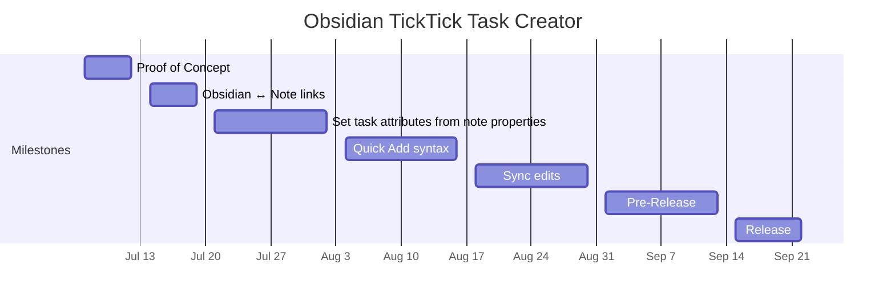

# Milestone Chart - Obsidian TickTick Task Creator

## Overview

Obsidian TickTick Task Creator is an Obsidian plugin designed to create TickTick tasks based on note properties. This plugin is intended to support a workflow in which TickTick is used as the primary task management tool (used to schedule, track, and prioritize), while Obsidian is used to manage detailed project plans and supporting information.

## Milestones

| Milestones                                          | Deliverables                                                                                                                                                                                                                                                                                         | Target Date | Dependencies                                                  | Status   |
| --------------------------------------------------- | ---------------------------------------------------------------------------------------------------------------------------------------------------------------------------------------------------------------------------------------------------------------------------------------------------- | ----------- | ------------------------------------------------------------- | -------- |
| Proof of concept                                 | TickTick Task Creator can create a task in TickTick based on the title of an Obsidian note. Task creation is controlled on a per-note basis.  Authorization flow for initial setup                                                                                                             | 2025-07-11  | None                                                          | Planned  |
| Task ↔ Note links                                   | Insert a link to the Obsidian note in the description of a created TickTick task.  Add a link to a created TickTick task to the properties of the associated Obsidian note.                                                                                                                    | 2025-07-18  | Basic task creation                                           | Planned  |
| Set task attributes from note properties            | Set the due date, list, priority, and tags of a created TickTick task based on YAML properties of the Obsidian note.  Create plugin settings to configure associations between frontmatter keys and task attributes.                                                                           | 2025-08-01  | Basic task creation                                           | Planned  |
| Set task attributes using TickTick Quick Add syntax | Set task attributes using TickTick Quick Add syntax in Obsidian note properties. For instance, `ticktick-attrs: !High ~Home`  creates a task with High priority in the user's Home list.  The plugin is responsible for parsing this input, as it isn't supported directly by the TickTick API. | 2025-08-15  | Basic task creation                                           | Planned  |
| Sync edits to note properties to TickTick           | For notes associated with tasks, watch for changes to note properties, and update associated tasks accordingly.                                                                                                                                                                                | 2025-08-29  | Set task attributes from note properties Task ↔ Note links | Planned  |
| Pre-Release                                        | User-facing documentation  Security review  Call for beta testers                                                                                                                                                                                                                        | 2025-09-12  | All previous milestones                                       | Planned  |
| Release                                             | Submit for inclusion in Obsidian Community Plugins                                                                                                                                                                                                                                     | 2025-09-26  | Beta testing complete; issues resolved                        | Planned  |

