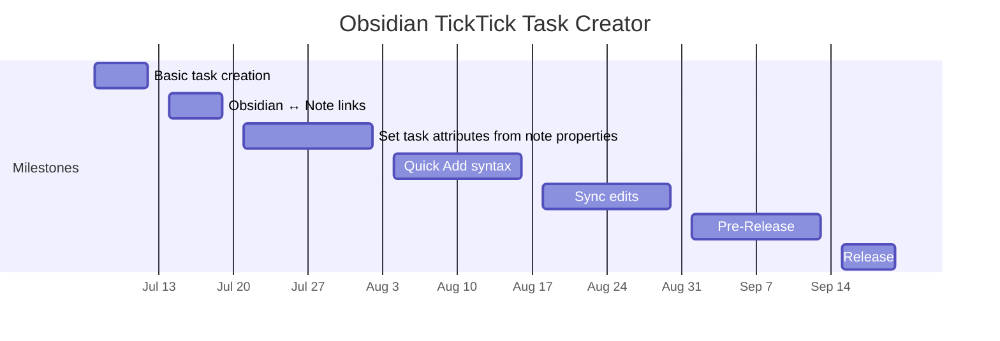

# TickTick Task Creator Project Plan

## Summary

Obsidian has some incredible features for knowledge management, but for keeping a to-do list, it's an awkward choice at best. TickTick is a highly flexible task-management app with relatively limited note-taking features.

As a user of both systems, some of my tasks in TickTick are associated with supporting information in my Obsidian vault. Without this plugin, I have to enter this information redundantly. Obsidian TickTIck Task Creator will create tasks in TickTick based on the name and frontmatter properties of an Obsidian note, saving time and improving data consistency.

## Objectives

- All planned features implemented by September 1, 2025
  - With at least 90% test coverage
- First draft of user documentation for all planned features by September 12
- Submit for inclusion in Obsidian Community Plugins by the end of September
- Plugin has more than one user by the end of October

## Scope

### Must Have

- Obsidian plugin creates tasks in TickTick based on notes in Obsidian
- Maintain links from a TickTick task to the original Obsidian note, and from the note to its associated TickTick task
- TickTick task attributes set based on Obsidian note properties
  - Settings to configure associations between frontmatter keys and task attributes
- Set task attributes based on TickTick Quick Add syntax
- Effective test suite
- Clear user documentation

### Nice to Have

- Sync edits to Obsidian note properties to an associated TickTick task
- Natural language date parsing within Quick Add strings
- 100% test coverage

### Out of Scope

- Syncing Obsidian note content to TickTick task description
- Bidirectional or TickTick → Obsidian sync
  - May be considered for a future version

## Deliverables

- Functioning plugin prototype
- User documentation

## Stakeholders

- Me as planner, developer, and user
- Obsidian community - users, testers, perhaps future contributors
- TickTick - API provider

## Timeline

See [Milestone Chart](Milestones.md)

## Resources

Aside from myself,

- Obsidian Members Group discord for help and feedback
- Friends for security review and additional support
- GitHub for documentation and bug tracking

## Risks

- Insufficient time for the project - may be occupied by higher priorities
  - Mitigated by narrow scope and relaxed schedule
- TickTick API limitations
  - One unwelcome surprise here already: the TickTick API does not support operations on task tags.
- Mangling Obsidian or TickTick data
  - Mitigate with separate Obsidian vault and TickTick account for testing
- Improper handling of auth token or sensitive user data
  - Mitigations: careful design, code review

## Communication Plan

Naturally, project information will be managed in my Obsidian vault, and associated tasks will be tracked in TickTick.

The Obsidian Discord server will be used to solicit help with technical questions, find beta testers, share progress, and respond to user questions and feedback.

The repository wiki will be used to host user documentation. GitHub Issues will be used to collect bug reports and feature requests.

## Success Metrics

- Plugin reliably and correctly creates TickTick tasks based on user configuration
- Test suite accurately characterizes plugin behavior and quickly reveals regressions.
- Plugin saves users time and improves data consistency
- Inclusion in Obsidian Community Plugins
- Plugin has more than one user
