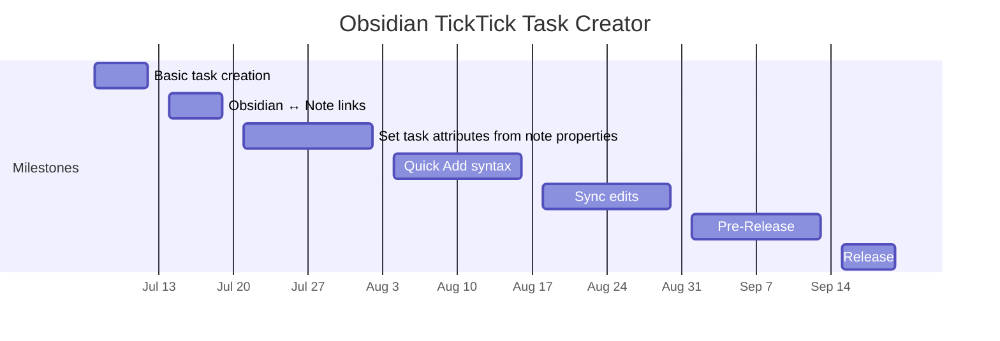

# TickTick Task Creator Project Plan

## Summary

Obsidian has some incredible features for knowledge management, but for keeping a to-do list, it's an awkward choice at best. TickTick is a highly flexible task-management app with comparatively limited note-taking features.

As a user of both systems, some of my tasks in TickTick are associated with supporting information in my Obsidian vault. Without this plugin, I have to enter this information redundantly. Obsidian TickTIck Task Creator will create tasks in TickTick based on the name and frontmatter properties of an Obsidian note, saving time and reducing errors and inconsistencies.

## Scope

### Must Have

- Obsidian plugin creates tasks in TickTick based on notes in Obsidian
  - OAuth
- Maintain links from a TickTick task to the original Obsidian note, and from the note to its associated TickTick task
- TickTick task attributes set based on Obsidian note properties
  - Settings to configure associations between frontmatter keys and task attributes
- Set task attributes based on TickTick Quick Add syntax
- Good test coverage
- Clear user documentation

### Nice to Have

- Sync edits to Obsidian note properties to an associated TickTick task
- Natural language date parsing within Quick Add strings
- 100% test coverage
- Inclusion in Obsidian Community Plugins directory

### Out of Scope

- Syncing Obsidian note content to TickTick task description
- Bidirectional or TickTick → Obsidian sync
  - May be considered for a future version

## Timeline

See [Milestone Chart](milestones.md)

## Resources

Aside from myself,

- Obsidian Members Group discord for help and feedback
- Friends for security review and additional support
- GitHub for documentation and bug tracking

## Risks

- TickTick API limitations
  - One unwelcome surprise here already: the TickTick API does not support operations on task tags.
- Insufficient time for the project - may be occupied by higher priorities.

## Dependencies

- User documentation (before beta testing)
- Beta testing (before submission to Community Plugins)
- Security review (before submission to Community Plugins)

## Quality Assurance

- Test-driven development workflow
- Beta testing
